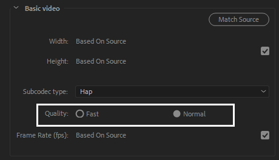

# Hap Exporter for Adobe CC

This is the community-supplied Hap and Hap Q exporter plugin for Adobe CC 2019 and Adobe CC 2020.

HAP is a collection of high-performance codecs optimised for playback of multiple layers of video.

Exporter plugins are provided for
- Adobe Media Encoder
- Adobe Premiere
- Adobe After Effects

Please see [license.txt](license.txt) for the licenses of this plugin and the components used to create it.

## Getting it

An installer for the exporter can be downloaded [here](https://github.com/disguise-one/hap-encoder-adobe-cc/releases).

## Requirements

This codec has been tested on Windows 10 and macOS Catalina.

It has been tested in Adobe CC 2019 and Adobe CC 2020.

## Support

Users can contact happlugin@disguise.one for support.

## Installation

Run the provided installer.

## Usage

### Adobe Media Encoder and Adobe Premiere

After installation, the encoders will be available as the 'HAP Video' format when exporting in Adobe Media Encoder or Adobe Premiere

After choosing the format, codec options may be chosen.

Default presets are supplied and are available in Adobe Media Encoder.

Movies that are encoded with the plugin are exported into .mov files.

### Adobe After Effects

The HAP codecs may be selected by choosing 'Quicktime HAP Format' on an output module.

### Choosing the right codec for the job: Hap, Hap Alpha, Hap Q and Hap Q Alpha

There are four different flavors of HAP to choose from when encoding your clips.

 codec       | properties
 ----------- | --------------------------------------------------------------------------------
 Hap         | lowest data-rate and reasonable image quality                                    
 Hap Alpha   | same image quality as Hap, and supports an Alpha channel                         
 Hap Q       | improved image quality, at the expense of larger file sizes                      
 Hap Q Alpha | improved image quality and an Alpha channel, at the expense of larger file sizes 

### Codec parameters
For Hap and Hap Alpha codecs render time can be reduced with Quality-Fast option. It uses fast and simple algorithm, but with reduced image quality.

- Fast suggested for draft renders, last-minute notebook renders, etc...
- Normal is default option for general renders

An optional specified number of chunks size may be specified to optimize for ultra high resolution video on a particular hardware system. This setting should typically only be used if you are reaching a CPU performance bottleneck during playback. As a general guide, for HD footage or smaller you can set the chunk size to 1 and for 4k or larger footage the number of chunks should never exceed the number of CPU cores on the computer used for playback.

At present, 'auto' corresponds to choosing 1 chunk per texture; this may change in the future.

## What is HAP

HAP is a collection of high-performance codecs optimised for playback of multiple layers of video.

HAP prioritises decode-speed, efficient upload to GPUs and GPU-side decoding to enable the highest amount of video content to be played back at once on modern hardware.

Please see

[http://hap.video/](http://hap.video/)

for details.

## Support

Users can contact happlugin@disguise.one for support.

## Known issues

Performing multiple parallel exports in Media Encoder may cause the system to become unresponsive, although the operation should eventually complete.

The plugin does not work in After Effects CC 2018.

## Development

Please see the instructions for the Codec Foundation upon which these plugins are based:
[https://github.com/codec-foundation/adobe-cc]

## Credits

Principal contributors to this plugin are

-  Greg Bakker (gbakker@gmail.com)
-  Richard Sykes
-  [Tom Butterworth](http://kriss.cx/tom)
-  [Nick Zinovenko](https://github.com/exscriber)

Development of this plugin was sponsored by [disguise](http://disguise.one), makers of the disguise show production software and hardware.

The Hap codec was developed by Tom Butterworth with the support of [VIDVOX](https://vidvox.net).

Many thanks to Tom Butterworth, David Lublin, Nick Wilkinson, Ruben Garcia and the disguise QA team for their assistance throughout development of this plugin.
