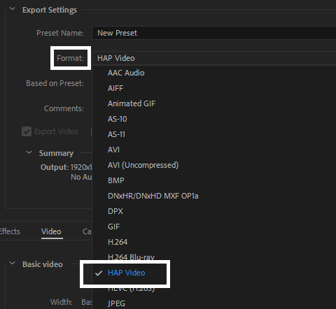
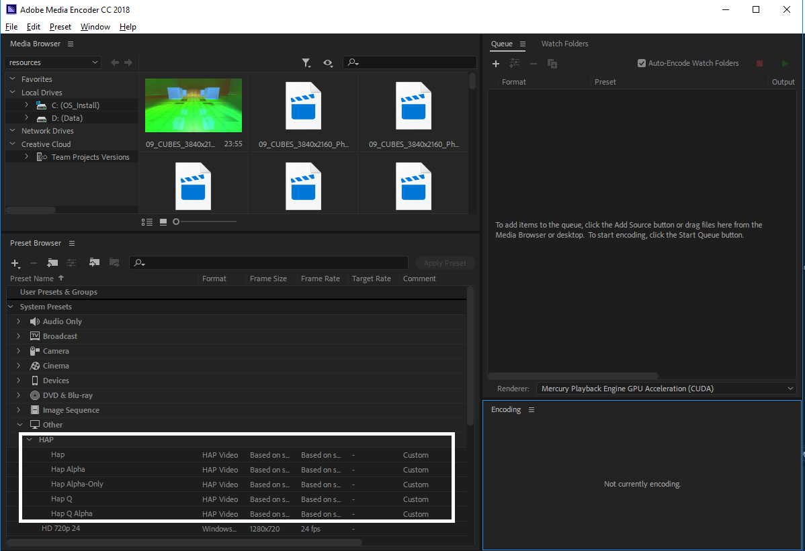
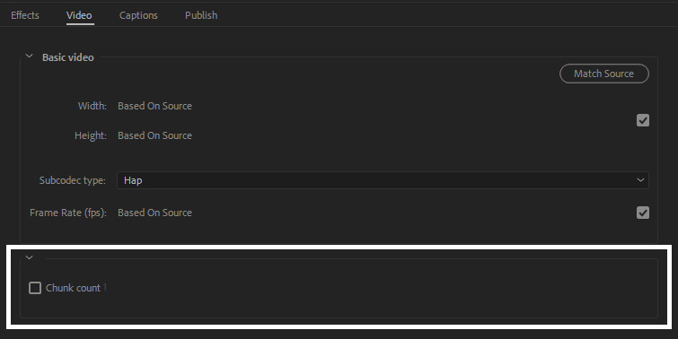

<header>

</header>

# Exporter for Adobe CC 2018

## Introduction

This is the community-supplied Hap and Hap Q exporter plugin for Adobe CC 2018.

HAP is a collection of high-performance codecs optimised for playback of multiple layers of video.

## Getting it

Releases of this plugin are available at

[https://github.com/disguise-one/hap-adobe-premiere-plugin/releases](https://github.com/disguise-one/hap-adobe-premiere-plugin/releases)

## Requirements

This codec has been tested on Windows 10, macOS High Sierra and macOS Mojave and supports Core i3 processors and later.

It has been tested in Adobe Media Encoder CC 2018 12.1.2.69.

## Support

Users can contact happlugin@disguise.one for support.

## Installation

Run the provided installer.

## Usage

After installation, the encoders will be available as the 'HAP Video' format when exporting in Adobe Media Encoder CC 2018 or Adobe Premiere CC 2018.

After choosing the format, codec options may be chosen.

Default presets are supplied and are available in Adobe Media Encoder.

Movies that are encoded with the plugin are exported into .mov files.

### Choosing the right codec for the job: Hap, Hap Alpha, Hap Q and Hap Q Alpha

There are four different flavors of HAP to choose from when encoding your clips.

Hap

:   lowest data-rate and reasonable image quality

Hap Alpha

:   same image quality as Hap, and supports an Alpha channel

Hap Q

:   improved image quality, at the expense of larger file sizes

Hap Q Alpha

:   improved image quality and an Alpha channel, at the expense of larger file sizes

### Codec parameters

An optional specified number of chunks size may be specified to optimize for ultra high resolution video on a particular hardware system. This setting should typically only be used if you are reaching a CPU performance bottleneck during playback. As a general guide, for HD footage or smaller you can set the chunk size to 1 and for 4k or larger footage the number of chunks should never exceed the number of CPU cores on the computer used for playback.

At present, 'auto' corresponds to choosing 1 chunk per texture; this may change in the future.

## What is HAP

HAP is a collection of high-performance codecs optimised for playback of multiple layers of video.

HAP prioritises decode-speed, efficient upload to GPUs and GPU-side decoding to enable the highest amount of video content to be played back at once on modern hardware.

Please see

[http://hap.video/](http://hap.video/)

for details.

## Known issues

Performing multiple parallel exports in Media Encoder may cause the system to become unresponsive, although the operation should eventually complete.

## Credits

Principal authors of this plugin are

-  Greg Bakker (gbakker@gmail.com)
-  Richard Sykes
-  [Tom Butterworth](http://kriss.cx/tom)

Development of this plugin was sponsored by [disguise](http://disguise.one), makers of the disguise show production software and hardware.

The Hap codec was developed by Tom Butterworth with the support of [VIDVOX](https://vidvox.net).

Many thanks to Tom Butterworth, David Lublin, Nick Wilkinson, Ruben Garcia and the disguise QA team for their assistance throughout development of this plugin.

